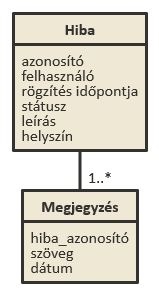

# Tudnivalók a dokumentációról

## A dokumentáció elhelyezése

### Github

A beadandót egy Github kódtárban (repository) kell tárolni. Ennek lépései:

1. Új kódtár létrehozása
2. Kódtár klónozása
    a. Helyi munka esetén: `git clone https://...`
    b. Cloud9 esetén: új workspace létrehozásakor meg lehet adni a kódtár elérhetőségét
3. Kód írása
4. Változások stage-elése: `git add .`
5. Változások mentése: `git commit`
6. Változások feltöltése: `git push` vagy `git push origin master`

A dokumentációt a Github kódtár `README.md` állományába kell megírni, ez jelenik majd meg a kódtár főoldalán.

### Markdown és GFM

A dokumentációt GFM-ben (Github Flavoured Markdown) formátumban kell megírni. Segítséget ehhez az alábbi linkeken lehet találni:

- [Összefoglaló a markdown formátumról a Github oldalán](https://help.github.com/articles/markdown-basics/)
- [Másik lényegretörő összefoglaló](http://www.web-crunch.com/resources/lowdown-markdown/)
- [Leírás a GFM-ről](https://help.github.com/articles/github-flavored-markdown/)

### Képek elhelyezése

A dokumentációnak képeket is tartalmaznia kell. Ehhez a képeket feltöltjük egy könyvtárba (pl. `docs/images`) és a dokumentációból [relatív útvonalként hivatkozunk rá](https://help.github.com/articles/relative-links-in-readmes/):

```

```

Az előző kódrészlet eredménye:


